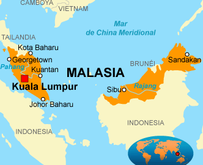

# Marketing campaign analysis project in Malaysia

## Description.
In this project we are going to analyze the **"Marketing Campaign Performance ”**, which contains detailed information about the performance of various marketing campaigns carried out by a company in Malaysia. The objective is to apply data processing and cleaning techniques, exploratory analysis and visualization to extract valuable insights that can improve the company's marketing strategies.

### Project objectives.
- **Understand and preprocess the dataset**: Identify and handle missing values, inconsistencies and outliers.
- **Perform exploratory data analysis (EDA)**: Discover patterns and significant relationships between variables.
- **Visualize data**: Create informative visualizations using Matplotlib, Seaborn and Plotly.
- **Draw conclusions**: Interpret results and provide recommendations based on the analysis.

### Dataset Description
The dataset includes the following features:

- **Campaign_ID**: Unique identifier of each campaign.
- **Channel**: Marketing channel used (e.g., Social Media, Email, TV, News, Radio, Billboard).
- **Product_Category**: Product category (e.g., Electronics, Fashion, Groceries, Automotive, Health).
- **Region**: Geographic region in Malaysia where the campaign was targeted (e.g., Kuala Lumpur, Penang, Malacca, Johor, Sabah, Sarawak).
- **Budget**: Allocated budget in Malaysian Ringgit.
- **Spend**: Actual campaign expenditure in Ringgit Malay.
- **Impressions**: Number of times the ad was viewed.
- **Clicks**: Number of clicks the ad received.
- **Click Through Rate**: Number of clicks the ad received.
- **Conversions**: Number of successful actions (e.g., purchases, registrations).
- **CR**: Conversion Rate (Conversion Rate).
- **Revenue**: Revenue generated by the campaign in Malaysian Ringgit.
- **ROI**: Return on Investment (Revenue divided by Spend).
- **Duration**: Campaign duration in days.
- **Start_Date**: Campaign start date.
- **End_Date**: Campaign end date.
- **Customer_Satisfaction**: Customer satisfaction rating (1 to 5).
- **Campaign_Effectiveness**: Effectiveness of the campaign according to the marketing team (1 to 10).
- **Market_Segment**: Target market segment (Low, Medium, High).
